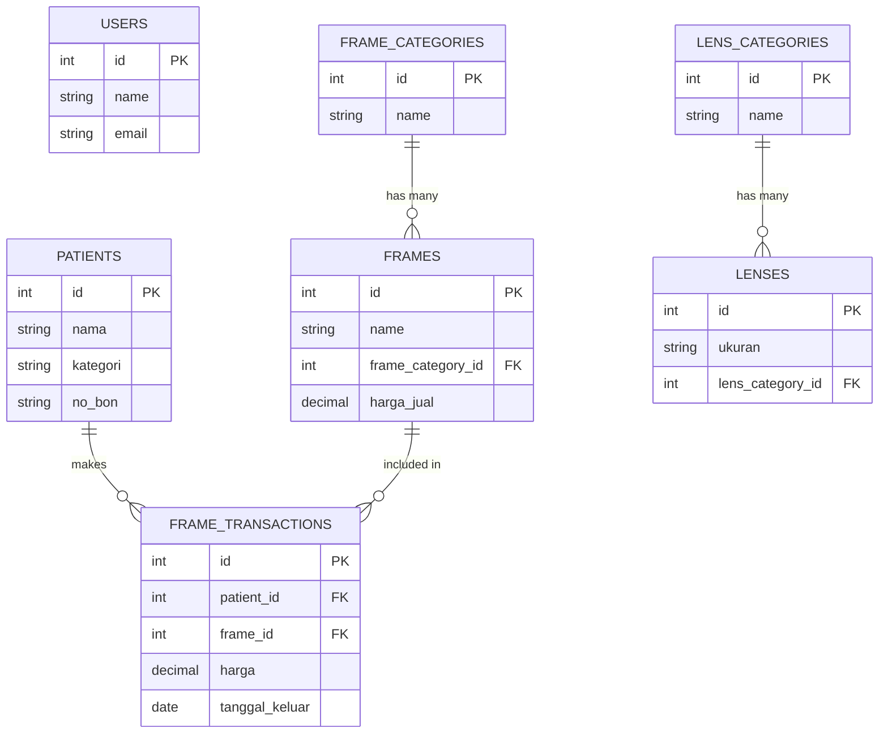

# Dokumentasi Relasi Database (ERD)

Dokumen ini berisi peta struktur tabel dan relasi database pada aplikasi Optik Suci untuk mempermudah rekan *developer* lain memahami alur data yang telah kita bangun.

## 1. Tabel Utama (Katalog & Master Data)

### `users`
Menyimpan data otentikasi (admin/petugas).
- **Relasi**: Belum ada relasi keluar. Berdiri secara mandiri.

### `patients` (Data Pasien)
Menyimpan informasi pelanggan/pasien (Nama, Kategori BPJS/Umum, No HP, Alamat, No Bon).
- **Relasi**: 
  - `hasMany` (Memiliki banyak) transaksi ke tabel `frame_transactions`. (Satu pasien bisa mengambil lebih dari satu frame di transaksi yang berbeda).

### `frame_categories` (Kategori Frame)
Data master (kategori/jenis/merk) yang akan dikaitkan dengan Frame.
- **Relasi**:
  - `hasMany` ke tabel `frames`. (Satu kategori bisa dimiliki banyak frame).

### `frames` (Katalog Frame)
Menyimpan daftar produk frame kacamata beserta harga beli dan harga jualnya.
- **Relasi**:
  - `belongsTo` ke tabel `frame_categories`. (Setiap frame merujuk pada satu kategori).
  - `hasMany` ke tabel `frame_transactions`. (Satu model frame bisa terjual berkali-kali).

### `lens_categories` (Kategori Lensa)
Data master yang mengklasifikasikan jenis lensa.
- **Relasi**:
  - `hasMany` ke tabel `lenses`.

### `lenses` (Katalog Lensa)
Menyimpan daftar tipe lensa, ukuran, index bias, aksesori, dsb.
- **Relasi**:
  - `belongsTo` ke tabel `lens_categories`.

---

## 2. Tabel Transaksional

### `frame_transactions` (Data Frame Keluar)
Tabel *pivot* / transaksional yang menghubungkan siapa pasien yang mengambil frame tertentu. Dibuat untuk mengatasi masalah pencatatan riwayat keluarnya frame.
- **Struktur Kunci:**
  - `patient_id` (Foreign Key -> `patients.id`)
  - `frame_id` (Foreign Key -> `frames.id`)
  - `harga` (Decimal)
  - `tanggal_keluar` (Date)
- **Relasi Utama**:
  - `belongsTo` ke tabel `patients`. (Setiap record transaksi adalah milik satu pasien).
  - `belongsTo` ke tabel `frames`. (Setiap record transaksi mencatat pengeluaran satu frame).

---

## Diagram Relasi Sederhana (Mermaid)

Berikut adalah visualisasi ERD-nya:

> [!TIP]
> **Catatan Pengembangan:** Jika kedepannya Anda ingin membuat fitur "Data Lensa Keluar", pendekatannya akan sama persis dengan `frame_transactions` (membuat tabel relasi antara `patients` dan `lenses`).
